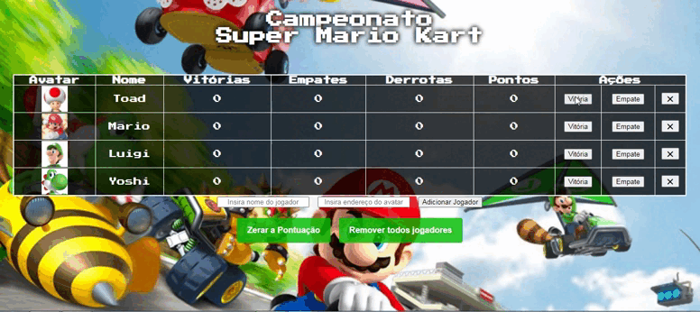

# Ranking-Table
Projeto desenvolvido durante a 6ª aula da 3ª Edição da Imersão Dev da Alura,  na qual criamos uma tabela de classificação utilizando os conceitos de Objetos em JavaScript.  
A tabela realiza cálculos para contabilizar as vitórias, empates e derrotas por meio de ações relacionadas as respectivas funções 
também dispoem de inputs para inserir novos jogadores com avatares através da insersão da URL da imagem.

